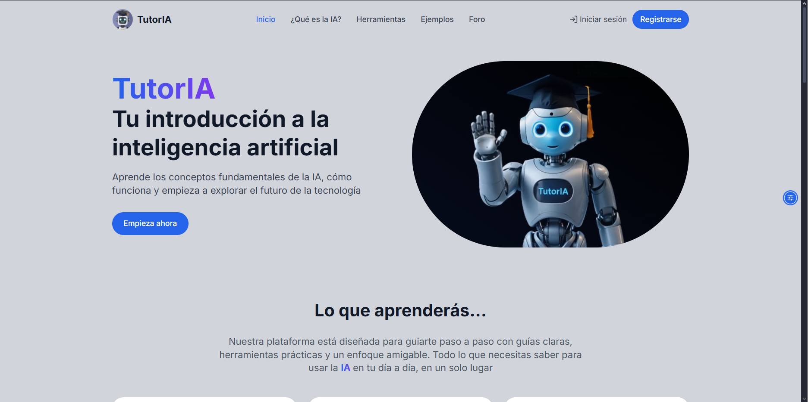
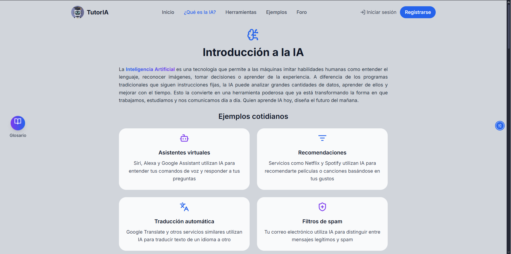
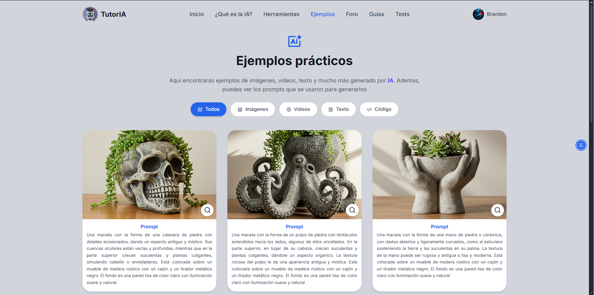
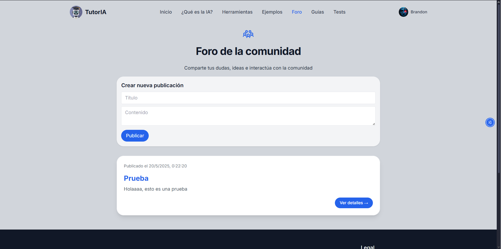
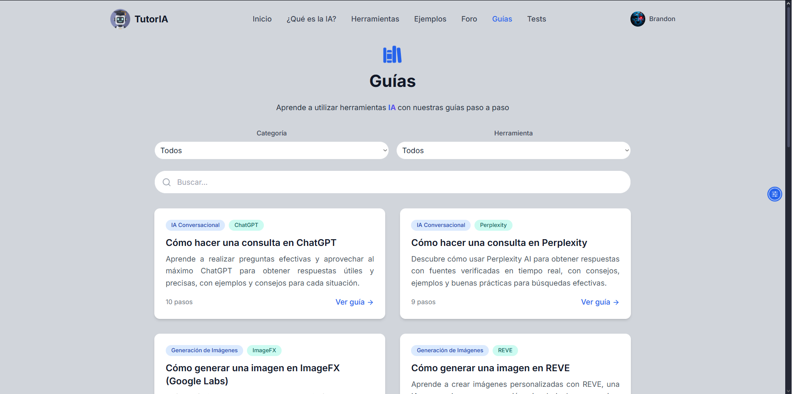
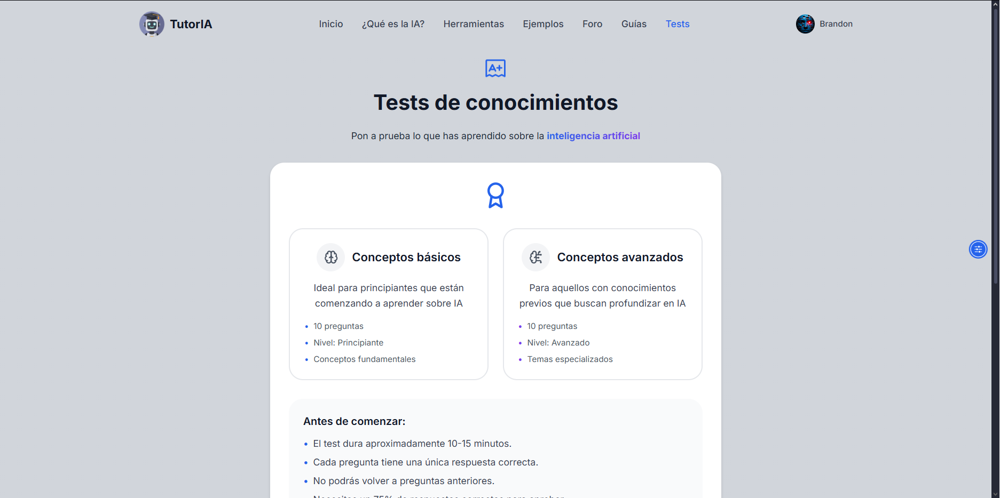
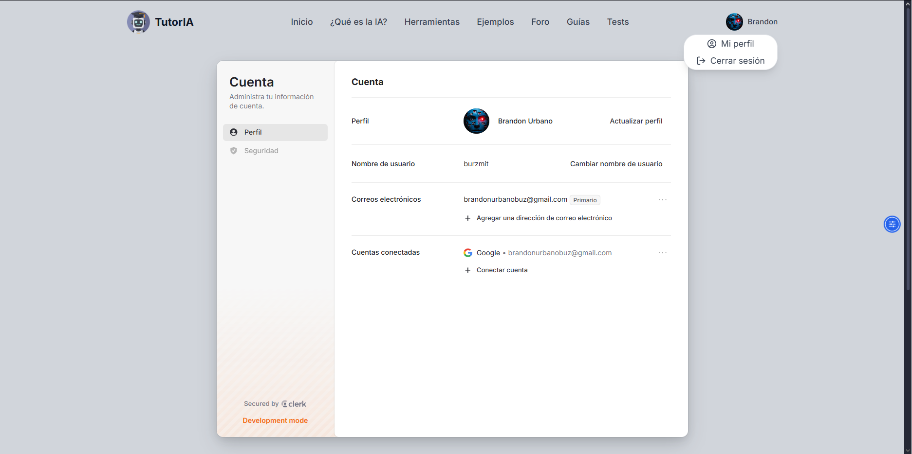
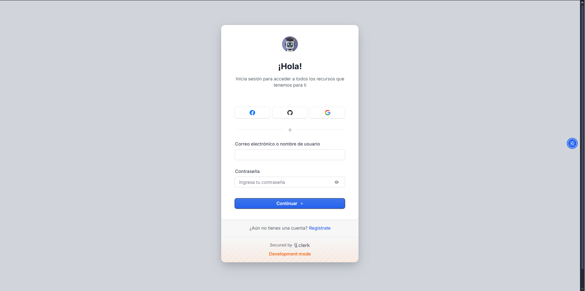
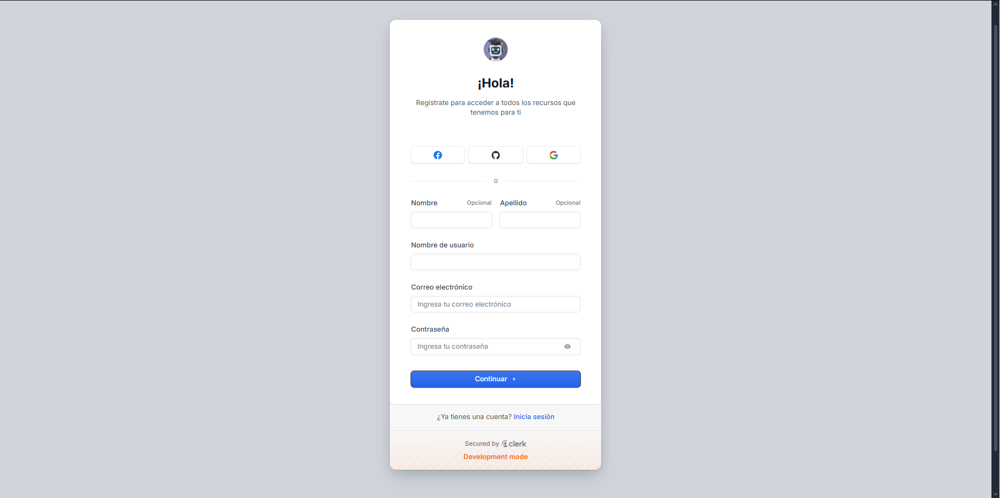

# TutorIA🤖🎓

TutorIA es una plataforma educativa diseñada para introducir a personas con poca o ninguna experiencia en el mundo de la Inteligencia Artificial. El objetivo es crear una experiencia amigable, interactiva y motivadora, ofreciendo contenido actualizado, guías prácticas, evaluaciones y más a medida que la plataforma avanza.

## 🌐 Acceso a la plataforma

[TutorIA🤖🎓](https://tutoria.dev-mit.com)

## 🧩 Funcionalidades   

- **Contenido educativo**: Explicaciones claras y concisas sobre conceptos de IA
- **Herramientas IA**: Directorio curado de herramientas populares de IA
- **Guías paso a paso**: Tutoriales prácticos para usar herramientas de IA
- **Ejemplos prácticos**: Ejemplos de imágenes, videos, texto y mucho más generado por IA
- **Tests**: Tests interactivos para medir el progreso
- **Foro**: Espacio para interactuar con la comunidad
- **Perfil de usuario**: Sistema de autenticación y perfiles personalizados

## 🛠️ Tecnologías

- **Frontend**: React, TypeScript, Vite
- **Estilos**: Tailwind CSS
- **Enrutamiento**: React Router DOM
- **Animaciones**: Framer Motion
- **Base de datos**: Supabase
- **Autenticación**: Clerk
- **Alertas**: SweetAlert2
- **Iconos**: Lucide React, React Icons
- **Accesibilidad**: UserWay

## 📁 Estructura del proyecto

```
TutorIA/
├── public/             # Archivos estáticos (imágenes, iconos, etc.)
├── src/                # Código fuente principal
│   ├── assets/         # Recursos multimedia
│   ├── components/     # Componentes reutilizables
│   ├── layouts/        # Estructuras de layout
│   ├── pages/          # Páginas de la app
│   └── ...             # Otros archivos fuente
├── package.json        # Dependencias y scripts
├── tailwind.config.js  # Configuración de Tailwind CSS
├── vite.config.ts      # Configuración de Vite
└── ...                 # Otros archivos y configuraciones
```

## 🛡️ Seguridad

- Autenticación segura con Clerk
- Validación de datos en frontend y backend
- Protección contra ataques XSS

## 📸 Capturas de pantalla

<div>
  
  
</div>
<div>
  
  
</div>
<div>
  
  
</div>
<div>
  
  
</div>
<div>
  
  
</div>
  